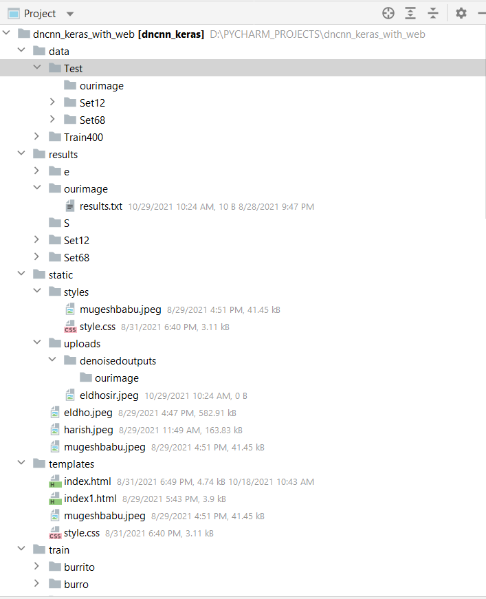
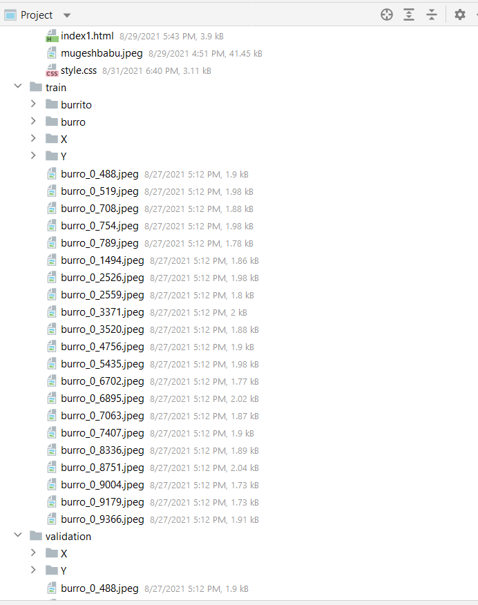
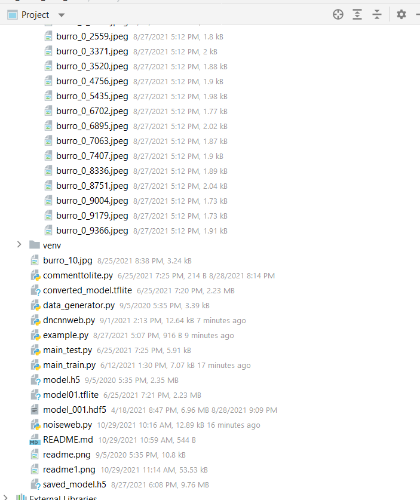

# FFCNN-keras     


## Dependence
```
tensorflow
keras2
numpy
opencv
flask
```






## Train 

```
main_train.py
```
## Test web for gaussian denoising with clean input image

```
dncnnweb.py
```
## Test web for gaussian denoising with noisy input image

```
noiseweb.py
```
## Results

### Gaussian Denoising

The average PSNR(dB) results of different methods on the BSD68 dataset.

|  Noise Level | BM3D | DnCNN | FFCNN |
|:-------:|:-------:|:-------:|:-------:|
| 25  |  28.57 | 28.83 | 29.84  |


